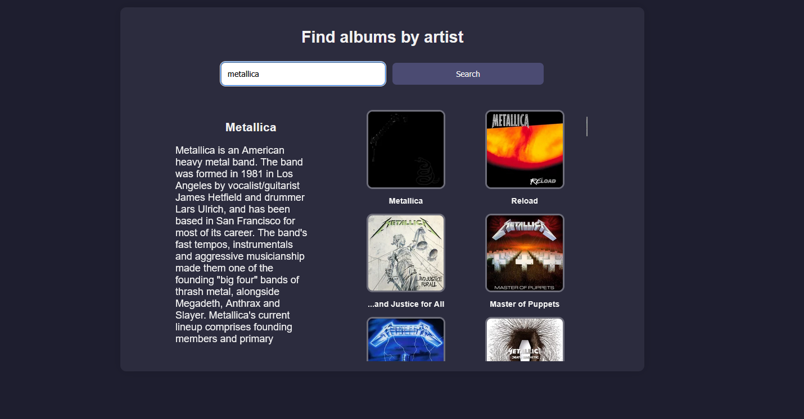
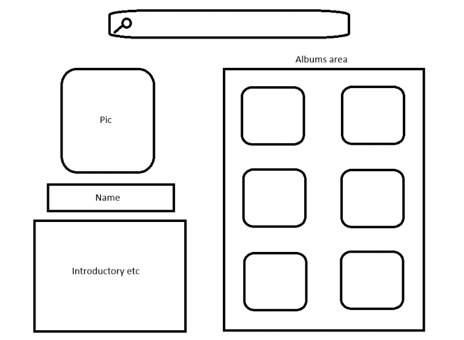

# Musinfo – Last.fm Music Explorer
Single author project by Mika

## Demo link:
Access the published app at: [https://musinfo.netlify.app](https://musinfo.netlify.app)

## How was the workload divided
This is a solo project. I'm responsible for everything: planning, coding, styling, debugging and documentation.

## Table of Content:

- [About The App](#about-the-app)
- [Screenshots](#screenshots)
- [Technologies](#technologies)
- [Setup](#setup)
- [Approach](#approach)
- [Status](#status)
- [Credits](#credits)
- [License](#license)

## About The App
Musinfo is a simple web app that allows users to search for a musical artist and display their basic biography and a list of their albums using Last.fm's REST API. The goal of the project was to learn how to use AJAX to call a live JSON API and dynamically update the UI with JavaScript.

## Screenshots
Here is a screenshot of the working application:  

And here is a screenshot of the plan for the website:  

## Technologies
I used the following technologies:
- `HTML`: for the app structure
- `CSS`: for layout and styling (including Flexbox & Grid)
- `JavaScript`: to fetch data and dynamically update the DOM
- `Last.fm REST API`: to get real-time artist and album data

## Setup
You don’t need to install anything to use the app.

Just open the live site here:
[https://musinfo.netlify.app](https://musinfo.netlify.app)

All features work directly in the browser using a live API.

## Approach
1. User inputs an artist name
2. JavaScript fetches artist info and albums from Last.fm API using AJAX
3. DOM is dynamically updated with the data
4. All event listeners are added via JavaScript
5. Includes dark mode layout and responsive design
6. Search can be triggered with both button click and pressing Enter

## Status
Musinfo is complete and fully functional. May be updated later for extra features like search history or filtering.

## Credits
- Layout and structure by Mika
- Used ChatGPT for technical guidance
- Last.fm API documentation: https://www.last.fm/api

## License
MIT License © Mika
